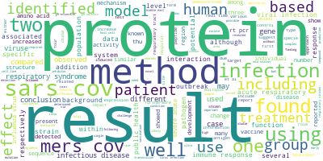
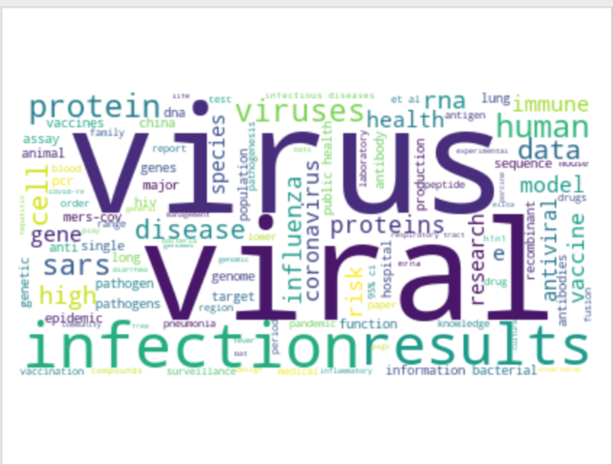
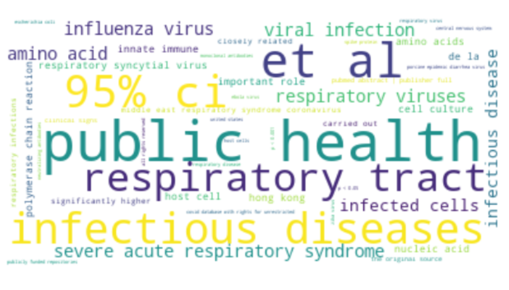

# COVID-Analysis

In this project, we aim to analyze the research documents related to Coronavirus family of viruses 
 that are made publicly available [here](https://pages.semanticscholar.org/coronavirus-research).   

## Analysis

We obtained the words from abstracts and its corresponding frequencies. 
After removing the stopwords, we created a wordcloud shown below:

  
We obtained the phrases from abstracts using [autophrase](https://github.com/shangjingbo1226/AutoPhrase) and its corresponding frequencies. 
After removing the stopwords, we created a wordcloud shown below:

We can observe that there are many unigrams in the above wordcloud. Hence, we removed unigrams
from the phrases and created the wordcloud shown below:

## Code

### Data
The data is too large to upload in github. Hence, made public [here](https://drive.google.com/open?id=1bnoWMVw1DlC2Y6o14U7c8WEj8-MBU2ov). 
- `df_29k.pkl` - This is a pickle dump of all 29k research articles.
- `df_29k_auth.pkl` - This is a pickle dump of research articles which has authors information,
title, abstract and body text. This contains 20k articles.

### Files

- `create_df.py`:
Creates pandas DataFrame from jsons and dumps it.

- `create_phrase_frequency_map.py`:
Parses autophrase output and creates wordcloud using these phrases and its corresponding frequencies.

- `parse_autophrase_output.py`:
Parses autophrase output and replaces phrases by pseudowords-"fnust[phrase_id]". 

- `word_cloud.py`:
Tester file to play around with wordcloud.

- `write_to_file.py`:
Writes text into a file to use it as input for autophrase.

- `test.py`:
Scratch paper for testing anything.

- `topic_modelling.py`:
Does topic modeling using LDA.

- `word2vec.py`, `word2vec_utils.py`:
Builds word-vectors from abstracts of all research papers.

- `update_utils.py`, `pagerank.py`, `data_utils.py`, `construct_graph.py`,
`cocube_variations.py`, `cocube_utils_beta.py`, `cocube_beta.py`, 
`coc_data_utils.py`: 
Performs weakly supervised classification to classify research articles into
`SARS`, `MERS`, `COVID-19` based on their disease of focus.

- `create_docid_maps.py`:
Creates Phrase-DocId, Author-DocId map.
 
- `keras_han`: Hierarchical Attention Networks code.

